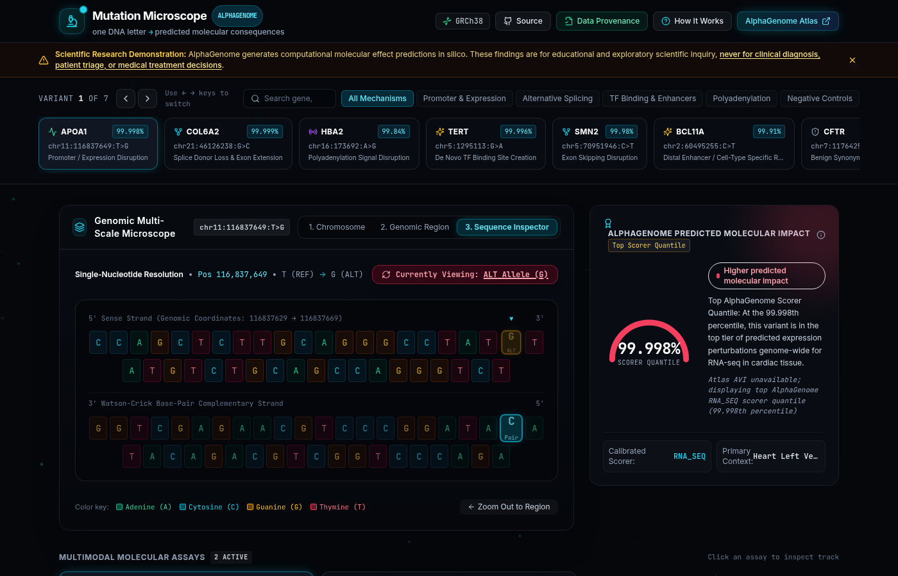

# Mutation Microscope 🔬

**Interactive Multi-Scale Genomic Observatory for AlphaGenome Variant Effect Predictions**

*An interactive genomic observatory for visualizing, exploring, and understanding Google DeepMind AlphaGenome regulatory variant effect predictions down to the single-nucleotide level in human genome GRCh38.*

👉 [**Launch Live Demo: mutation-microscope.vercel.app**](https://mutation-microscope.vercel.app)

[](https://github.com/cyb3rcricket/mutation-microscope/actions/workflows/ci.yml)
[](docs/ARCHITECTURE.md)
[](docs/PROVENANCE.md)
[](https://deepmind.google.com/science/alphagenome/)
[](https://www.ncbi.nlm.nih.gov/grc/human)
[](https://doi.org/10.1038/s41586-025-10014-0)

---

### Dashboard Preview

*Interactive observatory dashboard demonstrating single-nucleotide variant effect visualization across chromosome, gene body, and sequence scales with comparative epigenomic tracks.*  
*(Note: To update the dashboard preview graphic, place an exported screenshot at `docs/assets/preview.png`)*

---

## ⚡ What I Engineered vs. What AlphaGenome Is

To evaluate this project accurately, it is essential to distinguish between the underlying biological foundation model and the software platform engineered in this repository:

| Dimension | Google DeepMind AlphaGenome (Foundation Model) | Mutation Microscope (What I Engineered) |
| :--- | :--- | :--- |
| **Role & Purpose** | Pre-trained 1Mb transformer predicting epigenomic tracks and variant effect scores directly from raw DNA sequences (*Nature* 2026). | Interactive multi-scale visualizer, comparative analysis workspace, and scientific provenance engine for applied AI genomics. |
| **User Interface** | Model weights, official Python client (`alphagenome`), and exploratory web portal (AlphaGenome Atlas). | 3-level semantic zoom (Chromosome → Gene Body → Single-Base), REF vs ALT comparative tracks, real-time delta scrubbing, and Sashimi arc plots. |
| **Data Provenance** | Model output matrices and scalar quantiles. | Radical 6-tier field-level scientific provenance system (`live_api`, `atlas`, `published_exact`, `derived`, `reconstructed`, `illustrative`) with in-app audit modals. |
| **Runtime Model** | Compute-heavy deep learning inference requiring GPUs or authenticated gRPC endpoints. | **Zero-secret, offline-first client runtime** bundling curated benchmark variants into deterministic JSON artifacts running at 60 FPS in standard browsers. |
| **Data Pipeline** | Raw API requests and evaluation scripts. | Modular, reproducible Python pipeline (`uv`) decoupling declarative benchmark records from compiler logic with strict schema validation gates. |
| **Production Delivery** | Cloud API service. | Fully automated CI/CD lifecycle (lint, strict typecheck, 33 automated unit & user-flow tests, static edge deployment via Vercel). |

---

## 🎯 Core Technical Highlights

1. **3-Level Multi-Scale Semantic Zoom**:
   - **Level 1 (Chromosome Ideogram)**: Interactive chromosome tube (0 Mb to pter/qter) with p/q cytobands, centromeric notch, and pulsing variant locus markers.
   - **Level 2 (Genomic Region & Gene Body)**: Exon-intron organization, transcription directionality, strand orientation, and regulatory landmark annotations.
   - **Level 3 (Nucleotide Sequence Inspector)**: Exact GRCh38 flanking sequence, color-coded nucleotides (A/C/G/T), and 1-click REF ↔ ALT base morphing.

2. **Synchronized REF vs ALT Comparative Tracks**:
   - Simultaneous inspection of REFERENCE (wild-type) vs ALTERNATE (mutant) continuous genomic signals across 1Mb windows.
   - Coordinated scrubbing crosshair reporting exact numerical signal values and delta (`ALT − REF`) at every genomic position.
   - Dynamic Sashimi splicing viewer rendering predicted junction arcs and highlighting exon extension/skipping events.

3. **In Silico Mutagenesis (ISM) Heatmaps**:
   - 4-nucleotide substitution matrices (A, C, G, T) across regulatory motifs (e.g. ETS consensus in `TERT`, polyA signal in `HBA2`).
   - Visual heatmap explaining why the specific observed mutation is uniquely disruptive compared to alternative base substitutions.

4. **6-Class Scientific Provenance Framework**:
   - Every score, coordinate, and track is explicitly audited into: `live_api`, `atlas`, `published_exact`, `derived`, `reconstructed`, or `illustrative` (see [docs/PROVENANCE.md](docs/PROVENANCE.md)).
   - In-app Data Provenance modal providing complete audit trails for every field in the dataset.

5. **Deterministic Offline Replay with Optional Live API Enrichment**:
   - Fully functional and testable without credentials. The public Vercel production web app requires zero secrets and runs strictly from committed static data.
   - Optional developer-side `--fetch-live` pipeline flag enriches variants using DeepMind's official gRPC API when `ALPHAGENOME_API_KEY` is provided in the process environment, with automated fallback invariants.

---

## 🧬 7 Curated Benchmark Human Variants

Mutation Microscope ships with an audited dataset of curated benchmark human variants combining published AlphaGenome benchmarks, DeepMind Science Skills, authoritative GRCh38 genomic coordinates, and explicitly labeled educational controls:

| # | Variant & Gene | Mechanism Category | Primary Assay / Metric | Disease / Biological Association | Evidence Class |
|---|----------------|--------------------|------------------------|----------------------------------|----------------|
| 1 | **`APOA1`**<br>`chr11:116837649:T>G` | **Promoter / Expression Disruption** | RNA-seq (Heart LV raw -0.99, quant 0.99998; Liver raw +0.14) | Hypoalphalipoproteinemia (HDL Deficiency) | `derived` / `published_exact` |
| 2 | **`COL6A2`**<br>`chr21:46126238:G>C` | **Splice Donor Loss & Exon Extension** | Splice Sites (Canonical loss >14; Cryptic gain +14 at +60bp) | Ullrich Congenital Muscular Dystrophy | `derived` / `published_exact` |
| 3 | **`HBA2`**<br>`chr16:173692:A>G` | **Polyadenylation Signal Disruption** | Splice Junctions (+1.07 raw in K562 erythroid; PolyA -2.45) | Hemoglobin H Disease / Alpha-Thalassemia | `derived` / `published_exact` |
| 4 | **`TERT`**<br>`chr5:1295113:G>A` (C228T) | **De Novo TF Binding Site Creation** | ChIP-TF (ETS/GABP gain +1.52; ATAC gain +1.18) | Urothelial Carcinoma / Glioblastoma / Melanoma | `derived` / `published_exact` |
| 5 | **`SMN2`**<br>`chr5:70951946:C>T` | **Exon Skipping Disruption** | Splice Junctions (6→8 skip arc raw +2.84, quant 0.9998) | Spinal Muscular Atrophy (SMA) | `derived` / `published_exact` |
| 6 | **`BCL11A`**<br>`chr2:60495255:C>T` | **Distal Lineage Enhancer Regulation** | ChIP-TF (Erythroid GATA1 loss -1.41; Brain neutral) | Fetal Hemoglobin (HbF) Persistence | `derived` / `published_exact` |
| 7 | **`CFTR`**<br>`chr7:117642567:A>G` | **Benign Synonymous Control** | Flat delta tracks across all modalities (Scorer 2.1 percentile) | External Biological Negative Control | `illustrative` / `published_exact` |

---

## 🛠️ Quick Start & Local Setup

### Prerequisites
- **Node.js**: v18+ (tested on Node v20/v22) and `npm`
- **Python**: 3.10+ and [`uv`](https://docs.astral.sh/uv/) (for dataset compilation and verification)

### Installation
```bash
# 1. Clone repository
git clone https://github.com/cyb3rcricket/mutation-microscope.git
cd mutation-microscope

# 2. Install Node dependencies
npm install

# 3. Start local development server
npm run dev
```
Open [http://localhost:5173](http://localhost:5173) in your browser.

---

## 🧪 Verification & Test Suite

The repository enforces automated validation across the frontend, TypeScript types, and Python data pipelines:

```bash
# Run ESLint check
npm run lint

# Run TypeScript typecheck (strict mode)
npm run typecheck

# Run Vitest test suite (33 tests: dataset integrity, components, user flows)
npm test

# Run dataset schema and provenance validation
uv run scripts/validate_dataset.py

# Recompile and verify static dataset artifacts
uv run scripts/generate_dataset.py --verify

# Build production bundle
npm run build
```

---

## 📡 Optional Live AlphaGenome API Enrichment

### Zero-Secret Production vs. Developer Pipeline Separation
Mutation Microscope is designed as a strictly **offline-first, zero-secret scientific application**:
- **Public Production Web App**: The public production app hosted on Vercel does **NOT** require `ALPHAGENOME_API_KEY`. It runs entirely from the committed, provenance-audited dataset in [`src/data/variants.json`](src/data/variants.json) and metadata in [`src/data/metadata.json`](src/data/metadata.json).
- **Client Boundary**: `ALPHAGENOME_API_KEY` is never required by, bundled with, or exposed to the React/Vite client. Browser sessions execute zero live gRPC or REST calls to Google DeepMind servers.
- **Developer Pipeline Only**: The API key is exclusively used by the developer-side Python compilation pipeline when explicitly invoked with the `--fetch-live` flag:
  ```bash
  uv run scripts/generate_dataset.py --fetch-live
  ```

### What Live Mode Enriches vs. What Remains Curated
When `--fetch-live` is executed with a valid key, the pipeline connects to DeepMind's AlphaGenome API (`dna_model.score_variant` via gRPC) and the Atlas client across supported modalities (`RNA_SEQ`, `DNASE`, `CHIP_TF`, `SPLICE_JUNCTION`):
- **Live Enriched**: Supported scalar AlphaGenome model outputs and calibrated quantile rankings populate each variant's `alphaGenomeScores` array and update the top impact quantile fields in `avi` under evidence class `live_api`.
- **Curated Benchmark Invariant**: Continuous 1Mb genomic tracks, dynamic Sashimi splicing arc data, reference/alternate sequences, in silico mutagenesis (ISM) matrices, and biological annotations **retain their existing provenance** (`published_exact`, `reconstructed`, `derived`, or `illustrative`). These rich structures are derived from published AlphaGenome benchmark literature and are **not** synthesized by live scalar queries.
- **`mixed` Source Mode Semantics**: Because live queries enrich scalar score arrays without replacing baseline structural tracks, successful live queries produce a `mixed` dataset source mode in `src/data/metadata.json` rather than treating the whole dataset as live.

### Environment Resolution & CLI Execution
The dataset generator reads `ALPHAGENOME_API_KEY` directly from the OS process environment using `os.environ.get("ALPHAGENOME_API_KEY")`.
> [!IMPORTANT]
> Neither the Python dataset pipeline nor Vite automatically loads `.env` files. You must export the variable in your terminal session before running the command.

**Safe macOS / Linux Setup:**
1. Register for an authorized API key at [deepmind.google.com/science/alphagenome](https://deepmind.google.com/science/alphagenome/).
2. Export the key into your active shell session:
   ```bash
   export ALPHAGENOME_API_KEY="your_alphagenome_api_key_here"
   ```
3. Run the live enrichment pipeline:
   ```bash
   uv run scripts/generate_dataset.py --fetch-live
   ```

### Automated Fallback Guarantee
If `ALPHAGENOME_API_KEY` is absent from your environment, or if network queries fail or time out, the pipeline **automatically preserves the curated benchmark records with their original provenance**. It logs an informational notice and completes dataset generation cleanly without crashing or throwing unhandled exceptions.

### 🔒 Security Warnings
- **Never commit API keys**: Do not commit keys or `.env` files to git.
- **Never use `VITE_` prefix**: Never name the key `VITE_ALPHAGENOME_API_KEY`. Any variable with a `VITE_` prefix is automatically embedded into client-side JavaScript bundles by Vite and becomes publicly visible to anyone inspecting the page.
- **Never configure in Vercel deployment variables**: Do not add `ALPHAGENOME_API_KEY` to Vercel project environment settings. The deployed web application is purely static and requires zero credentials.

---

## 🏛️ System Architecture

For a comprehensive technical breakdown of data flow, state management, security boundaries, and CI/CD pipelines, read [`docs/ARCHITECTURE.md`](docs/ARCHITECTURE.md).

For complete rules and definitions regarding the 6-tier scientific provenance classification, read [`docs/PROVENANCE.md`](docs/PROVENANCE.md).

---

## 📖 Citation & References

```bibtex
@article{Avsec2026,
  author    = {Avsec, {\v{Z}}iga and Latysheva, Natasha and Cheng, Jun and Novati, Guido and Taylor, Kyle R. and Ward, Tom and Bycroft, Clare and Nicolaisen, Lauren and Arvaniti, Eirini and Pan, Joshua and Thomas, Raina and Dutordoir, Vincent and Perino, Matteo and De, Soham and Karollus, Alexander and Gayoso, Adam and Sargeant, Toby and Mottram, Anne and Wong, Lai Hong and Drot{\'a}r, Pavol and Kosiorek, Adam and Senior, Andrew and Tanburn, Richard and Applebaum, Taylor and Basu, Souradeep and Hassabis, Demis and Kohli, Pushmeet},
  title     = {Advancing regulatory variant effect prediction with {AlphaGenome}},
  journal   = {Nature},
  volume    = {649},
  number    = {8099},
  pages     = {1206--1218},
  year      = {2026},
  doi       = {10.1038/s41586-025-10014-0}
}
```

---

## ⚖️ License & Disclaimer

- **Scientific Disclaimer**: Mutation Microscope provides *in silico* molecular predictions computed by AlphaGenome for educational exploration and research hypothesis generation. It is **never** intended for clinical diagnosis, patient triage, or medical treatment decisions.
- **Model Terms**: AlphaGenome and AlphaGenome Atlas are research technologies of Google DeepMind. See [.licenses/alphagenome_single_variant_analysis_LICENSE.txt](.licenses/alphagenome_single_variant_analysis_LICENSE.txt) for license terms.
