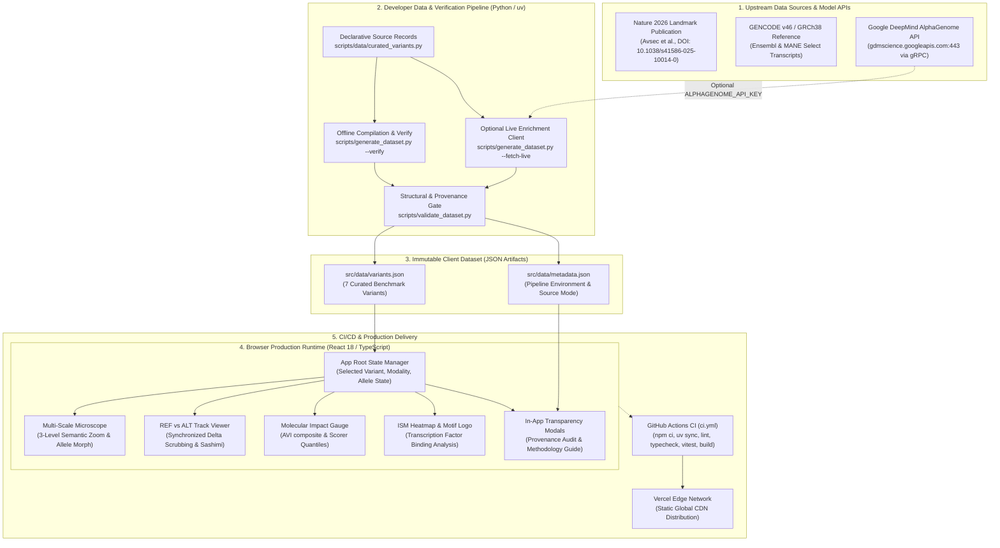
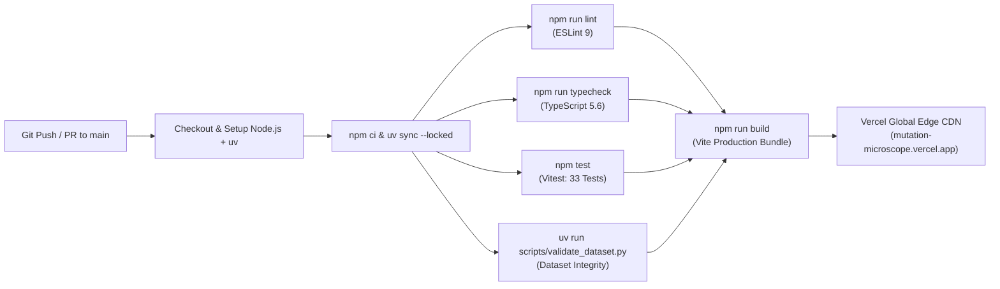

# Mutation Microscope — System Architecture & Engineering Specification

> Authoritative architectural guide for the Mutation Microscope applied AI genomics observatory, detailing the production runtime, developer compilation pipeline, optional live DeepMind API path, scientific provenance model, and CI/CD verification lifecycle.

---

## 1. Executive Architectural Summary

**Mutation Microscope** is an interactive genomic observatory engineered to visualize, explore, and contextualize AlphaGenome regulatory variant effect predictions from chromosome scale down to single-nucleotide resolution in human genome assembly GRCh38.

### Core Architecture Invariants
- **Offline-First & Zero Runtime Secrets**: The production web client requires zero API keys, zero backend servers, and zero runtime network dependencies to inspect all 7 curated benchmark variants. All genomic datasets, tracks, and metadata are bundled at compile time into static JSON assets.
- **Client-Side Reactive Computation**: Semantic zoom (chromosome ideogram → gene body/region → single-base sequence inspector), REF ↔ ALT comparative track views, synchronized crosshair scrubbing, modality filtering, and interactive in silico mutagenesis (ISM) logos execute client-side at 60 FPS in standard browser runtimes.
- **Auditable 6-Class Provenance Framework**: Every numerical score, genomic interval, and visualization track is tagged with an immutable evidence class (`live_api`, `atlas`, `published_exact`, `derived`, `reconstructed`, `illustrative`), guaranteeing radical transparency between true model predictions, benchmark literature, and pedagogical negative controls.
- **Explicit Research & Educational Scope**: Designed strictly as an educational and scientific demonstration tool. Never utilized for clinical diagnosis or medical decision-making.

---

## 2. End-to-End System Architecture

The following diagram details the flow of data from upstream research benchmarks and Google DeepMind services through the compilation pipeline into the production client runtime and edge deployment:



---

## 3. Production Runtime Architecture

The production application is implemented in React 18, TypeScript (strict mode), and TailwindCSS, packaged with Vite.

### Runtime Invariants
- **Zero API Key Requirement**: The web application never initiates network requests to Google DeepMind, NCBI, or Ensembl at runtime. All required variant data, splice junctions, continuous 1Mb tracks, and sequence windows reside directly in `src/data/variants.json`.
- **Reactive State Flow**:
  - `selectedVariant`: The active variant model from `variants.json`. When changed, automatically updates the header, ideogram, gene body, tracks, impact gauges, and ISM explorer.
  - `selectedModalityId`: Filters the active molecular assay (e.g. `RNA_SEQ`, `DNASE`, `CHIP_TF`, `SPLICE_JUNCTION`).
  - `alleleState`: Toggles between `'REF'` and `'ALT'`, triggering immediate visual coordinate shifts, sequence base morphing, and REF vs ALT comparative track updates.
  - `isTransparencyModalOpen` & `isProvenanceModalOpen`: Controls presentation of in-depth scientific methodology guides and field-level evidence audits.
- **Client-Side Rendering Performance**:
  - Continuous track visualizations and Sashimi plots are rendered as scalable SVG vectors with coordinated mouse scrubbing crosshairs, maintaining sub-16ms frame times.
  - An interactive background particle canvas (`ObservatoryCanvas`) reflects genomic nucleotides and automatically respects user `prefers-reduced-motion` settings.

---

## 4. Developer Data Pipeline & Provenance Architecture

Mutation Microscope separates declarative dataset definitions from compiler logic and validation gates.

### Package Layout
```
scripts/
├── __init__.py
├── data/
│   ├── __init__.py
│   └── curated_variants.py    # Declarative benchmark variant source records (~1,750 lines)
├── generate_dataset.py        # Compilation, live enrichment, and export pipeline (~280 lines)
└── validate_dataset.py        # Independent structural, coordinate, and provenance validation gate
```

### The Six Evidence Classes
Every numerical value, genomic coordinate, and sequence in Mutation Microscope belongs to one of six explicit evidence classes:

| Evidence Class | Badge Color | Definition | Verification Standard |
| :--- | :--- | :--- | :--- |
| `live_api` | Cyan | Value retrieved live from DeepMind AlphaGenome API via gRPC | Must record `scorer`, `biosample`, and UTC `retrievedAt` timestamp. |
| `atlas` | Indigo | Official AlphaGenome Atlas prediction | Confirmed Atlas composite impact score (AVI) or feature attribution. |
| `published_exact` | Emerald | Exact number, coordinate, or sequence reported in literature | Source publication DOI, figure reference, or authoritative GRCh38/GENCODE model. |
| `derived` | Blue | Calculated or mathematically transformed from source data | Transformation formula must be documented (e.g. ALT − REF delta, quantile percentile). |
| `reconstructed` | Amber | Recreated or interpolated from published figures or plots | Approximates genuine published findings; explicitly not claimed as exact raw source points. |
| `illustrative` | Rose | Synthetic educational control baseline | Explicitly fabricated to explain concepts (e.g. negative control flat lines); never claimed as model outputs. |

### Strict Offline Validation Gate (`scripts/validate_dataset.py`)
Prior to artifact compilation or CI pass, the validator verifies:
1. Valid JSON formatting and required top-level schemas across all variants.
2. Genomic coordinate validity in GRCh38 (`chrom` in chr1–22, X, Y; `pos` positive integer; `ref` and `alt` valid single nucleotides).
3. Flanking sequence integrity: central base matching `refBase` and `altBase`, consistent upstream/downstream lengths.
4. Multimodal assay coverage and valid numerical bounds for `rawScore`, `quantileScore` (0.0 to 1.0), and `primaryTissue`.
5. Strict adherence of every field-level audit record to the 6 evidence classes.

---

## 5. Optional Live API Enrichment Path

Mutation Microscope includes an optional live enrichment module utilizing the official `alphagenome` Python SDK.

### CLI Execution
```bash
# Offline verification mode (default; requires no credentials)
uv run scripts/generate_dataset.py --verify

# Live API query mode (requires valid DeepMind API key)
export ALPHAGENOME_API_KEY="your-key-here"
uv run scripts/generate_dataset.py --fetch-live
```

### Technical Implementation & Invariants
- **gRPC Connection**: Connects to `dns:///gdmscience.googleapis.com:443` using `dna_client.create(api_key=...)`.
- **Target Scorers**: Queries scalar variant scorers across biological modalities:
  - `RNA_SEQ` (Gene expression change in cardiac, liver, and epithelial tissues)
  - `DNASE` (Chromatin accessibility perturbation in erythroid and renal cells)
  - `CHIP_TF` (Transcription factor binding disruption/creation for GATA1, ETS/GABP)
  - `SPLICE_JUNCTION` (Alternative splice site disruption and exon skipping)
- **Data Tidy & Extraction**: Returned `AnnData` objects are processed via `variant_scorers.tidy_scores` into structured pandas tables.
- **`mixed` Source Mode Semantics**:
  - Live scalar model outputs enrich `alphaGenomeScores` and top calibrated impact quantiles under evidence class `live_api`.
  - **Explicit Architectural Boundary**: Continuous 1Mb genomic tracks, Sashimi splice junction curves, and ISM matrices retain their benchmark provenance (`published_exact` / `reconstructed` / `illustrative`) and are **NOT** synthesized by the live API query.
- **Fallback Guarantee**: If `ALPHAGENOME_API_KEY` is not detected, the pipeline automatically compiles the curated benchmark dataset without failure.

---

## 6. CI/CD & Deployment Path

Mutation Microscope uses GitHub Actions (`.github/workflows/ci.yml`) to enforce code quality, type safety, test coverage, and scientific data validity on every push and pull request.



---

## 7. Security & Threat Model

1. **Client-Side Secret Elimination**: Zero API keys, authentication tokens, or private endpoints exist in client-side code or bundled static assets.
2. **Environment Variable Containment**: `ALPHAGENOME_API_KEY` is strictly confined to developer local environments during optional `--fetch-live` runs. It is never committed, bundled, or loaded by Vite.
3. **Immutable Static Delivery**: All application assets are served as read-only static files over HTTPS with strict Content Security Policies via Vercel Edge CDN.
4. **Non-Diagnostic Sandboxing**: The interface prominently features an educational disclaimer banner, ensuring clear user context regarding the exploratory research nature of deep learning variant effect predictions.
